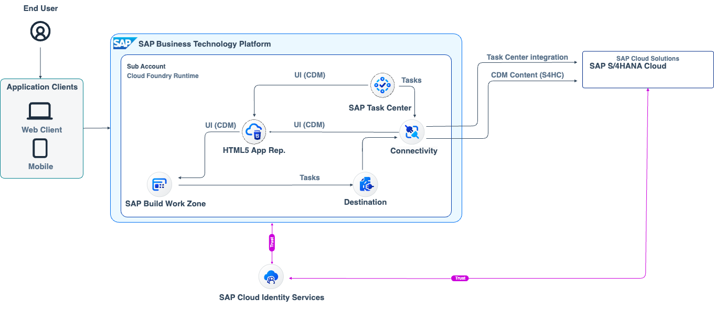

# XP262 - Combining SAP BTP Technologies in SAP’s New Entry Point Experience

## Description

This repository contains the material for the SAP TechEd 2022 session called Session ID - Session Title.  

## Overview

This session introduces attendees to learn how to setup and configure a "central entry point" based on SAP Build Work Zone Standard Edition and combining/integration other services like SAP Task Center.
Furthermore the attendees will learn how to consume UI content (interest cards) from SAP solutions like SAP S4/HANA Cloud and SAP SuccessFactors.

## Requirements

The requirements to follow the exercises in this repository are to have knowledge of SAP BTP concepts, nice to have is also a basic understanding of SAP Build Work Zone Standard Edition.

## SAP BTP Solution Architecture

## Exercises

Provide the exercise content here directly in README.md using [markdown](https://guides.github.com/features/mastering-markdown/) and linking to the specific exercise pages, below is an example.

- [Getting Started / enter you the SAP BTP environment](exercises/ex0/)
- [Exercise 1 - Create and configure you SAP Build Work Zone site](exercises/ex1/)
    - [Exercise 1.1 - Create your "site"](exercises/ex1#exercise-11-sub-exercise-1-description)
    - [Exercise 1.2 - Integrate applications to your site](exercises/ex1#exercise-12-sub-exercise-2-description)
    - [Exercise 1.3 - Deploy your own content package](exercises/ex1#exercise-11-sub-exercise-1-description)
    - [Exercise 1.4 - Design your site by creating spaces & pages](exercises/ex1#exercise-12-sub-exercise-2-description)
    - [Exercise 1.4 - Assign content to your site](exercises/ex1#exercise-13-sub-exercise-3-description)
    - [Exercise 1.5 - Enter your new site as enduser](exercises/ex1#exercise-14-sub-exercise-4-description)
- [Exercise 2 - Integrate and explore SAP Task Center](exercises/ex2/)
    - [Exercise 2.1 - Create a purchase requisition in SAP S/4HANA Cloud](exercises/ex2#exercise-21-create-a-purchase-requisition-in-sap-s4hana-cloud)
    - [Exercise 2.2 - Add SAP Task Center tile to your site](exercises/ex2#exercise-22-sub-exercise-2-description)
    - [Exercise 2.2 - Validate and explore the task](exercises/ex2#exercise-22-sub-exercise-2-description)
- [Exercise 3 - Integrate and explore SAP Mobile Start](exercises/ex2/)
    - [Exercise 3.1 - Enable SAP Mobile Start for your site](exercises/ex2#exercise-21-sub-exercise-1-description)
    - [Exercise 3.2 - Download/Activate your site in SAP Mobile Start](exercises/ex2#exercise-21-sub-exercise-1-description)
    - [Exercise 3.3 - Validate and explore content on your "mobile"](exercises/ex2#exercise-21-sub-exercise-1-description)

**IMPORTANT**

Your repo must contain the .reuse and LICENSES folder and the License section below. DO NOT REMOVE the section or folders/files. Also, remove all unused template assets(images, folders, etc) from the exercises folder. 

## Contributing
Please read the [CONTRIBUTING.md](./CONTRIBUTING.md) to understand the contribution guidelines.

## Code of Conduct
Please read the [SAP Open Source Code of Conduct](https://github.com/SAP-samples/.github/blob/main/CODE_OF_CONDUCT.md).

## How to obtain support

Support for the content in this repository is available during the actual time of the online session for which this content has been designed. Otherwise, you may request support via the [Issues](../../issues) tab.

## License
Copyright (c) 2023 SAP SE or an SAP affiliate company. All rights reserved. This project is licensed under the Apache Software License, version 2.0 except as noted otherwise in the [LICENSE](LICENSES/Apache-2.0.txt) file.
