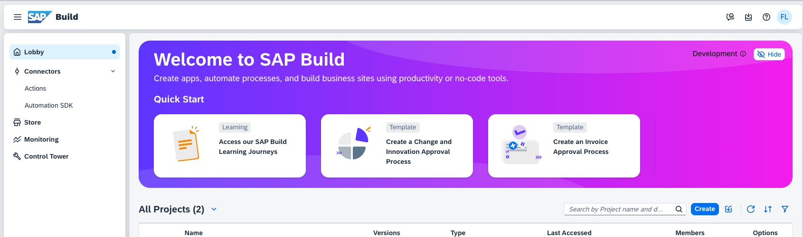

# Overview

In this exercise, you will test the access to the SAP Business Platform environment and validate the configuration for your SAP BTP subaccount which will be used throughout the session.

## Enter the SAP BTP environment / SAP Build Lobby

To get started please enter now the SAP Build Lobby to get started with this HandsOn:

## Summary

Congratulations! With this first exercise you have successfully validated access to SAP BTP and the SAP Build Lobby to get your hand's dirty by executing the next steps, continue now to the next exercise 
Continue to - [Exercise 1 - Exercise 1 Description](../ex1/README.md)
