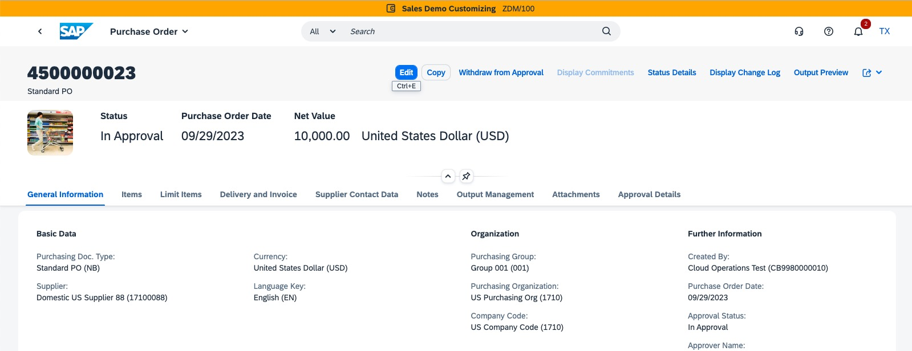

# Exercise 2 - Integrate and explore SAP Task Center

In this exercise, we will create a purchase requisition in SAP S/4HANA Cloud to see this PR in SAP Task Center.

## Exercise 2.1 create a purchase requisition in SAP S/4HANA Cloud

To create a PR please enter the following URL (https://s4hanacloudurl//ui#PurchaseOrder-manage&/C_PurchaseOrderTP(PurchaseOrder='4500000023',DraftUUID=guid'00000000-0000-0000-0000-000000000000',IsActiveEntity=true))



Click now on the ##copy## button:


Do not change anything an press finally the ##order## button:


## Exercise 2.2 Sub Exercise 2 Description

After completing these steps you will have...

1.	Enter this code.
```abap
DATA(lt_params) = request->get_form_fields(  ).
READ TABLE lt_params REFERENCE INTO DATA(lr_params) WITH KEY name = 'cmd'.
  IF sy-subrc = 0.
    response->set_status( i_code = 200
                     i_reason = 'Everything is fine').
    RETURN.
  ENDIF.

```

2.	Click here.
<br>

## Summary

You've now ...

Continue to - [Exercise 3 - Excercise 3 ](../ex3/README.md)
