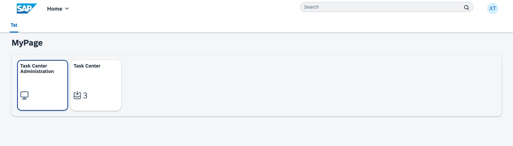

# Exercise 2 - Integrate and explore SAP Task Center

In this exercise, we will create a purchase requisition in SAP S/4HANA Cloud to see this PR in SAP Task Center.

## Exercise 2.1 create a purchase requisition in SAP S/4HANA Cloud

To create a PR please enter the following URL (https://s4hanacloudurl//ui#PurchaseOrder-manage&/C_PurchaseOrderTP(PurchaseOrder='4500000023',DraftUUID=guid'00000000-0000-0000-0000-000000000000',IsActiveEntity=true))

Click now on the ##copy## button:

Do not change anything an press finally the ##order## button:

## Exercise 2.2 add the SAP Task Center tile to your site

To add now the SAP Task Center web application to your newly created site please check also the official SAP documentation at [SAP Help](https://help.sap.com/docs/task-center/sap-task-center/create-task-center-tile-on-sap-build-work-zone-standard-edition)

To integrate the SAP Task Center applications please completing these steps:

1. Enter the site manager from SAP Build Work Zone [URL see Excercise 1](../ex1/README.md)
2. Switch now over to the content manager:

3. In the content manager you will see now the already available SAP Task Center apps and also multiple roles like **XP262_001_Role**:

4. 

By executing these steps you should have the SAP Task Center tiles available at the SAP Build Work Zone site manger:

Afterwards you can simply select the site manager from the right hand side and launch you site by pressing the "Go to site" icon:

After completing these steps you will have now successfully integrated the SAP Task Center applications in your site.

2.	Click here.

Continue to - [Exercise 3 - Excercise 3 ](../ex3/README.md)
