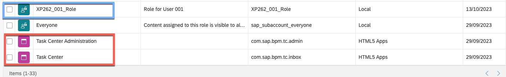

# Exercise 2 - Integrate and explore SAP Task Center

In this exercise, we will create a **purchase requisition** in SAP S/4HANA Cloud to get a Task for the PR approval in **SAP Task Center**.

## Exercise 2.1 create a purchase requisition in SAP S/4HANA Cloud

- To create a PR in S4HC please enter the following URL (https://myxxxx.s4hana.cloud.sap/ui#PurchaseOrder-manage&/C_PurchaseOrderTP(PurchaseOrder='4500000026',DraftUUID=guid'00000000-0000-0000-0000-000000000000',IsActiveEntity=true))

- In the upcoming screen Click now on the **copy** button:

- Do not change anything an press finally the **order** button:

## Exercise 2.2 add the SAP Task Center tile to your site

To add now the SAP Task Center web application to your newly created site please check also the official SAP documentation at [SAP Help](https://help.sap.com/docs/task-center/sap-task-center/create-task-center-tile-on-sap-build-work-zone-standard-edition)

For the integration of SAP Task Center into your new page please complete the upcoming steps:

- Enter the **site manager** from SAP Build Work Zone, please have a look on the exercise 1 for the [URL](../ex1/README.md) in case you missed it.
- Switch now over to the **content manager** to identify the content:

- In the content manager you will see now the already available SAP Task Center apps and also multiple roles like **XP262_001_Role**:

- To add now the SAP Task Center App's please **modify** the existing page

-  Select "Tile", to add the "SAP Task Center" tiles to your page.

- Switch now back to the **content manager** and select the role to enable the new applications:

After executing successfully these steps you should now have added the **SAP Task Center** tiles to your SAP Build Work Zone site!

Afterwards you can simply select the site manager from the right hand side and launch you site by pressing the "Go to site" icon:

**Congratulations you have now successfully integrated SAP Task Center in your site !!!** :wave:

## Exercise 2.3 Explore the SAP Task Center applications

By entering now your SAP Build Work Zone page as end user, you should now able to see SAP Task Center as part of your page.

